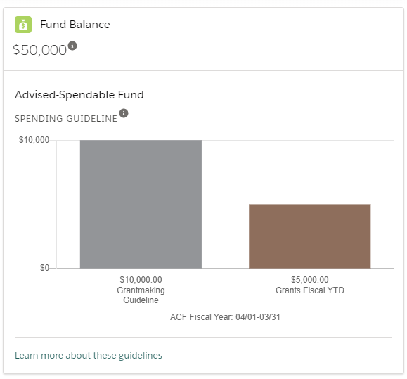
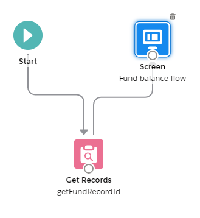
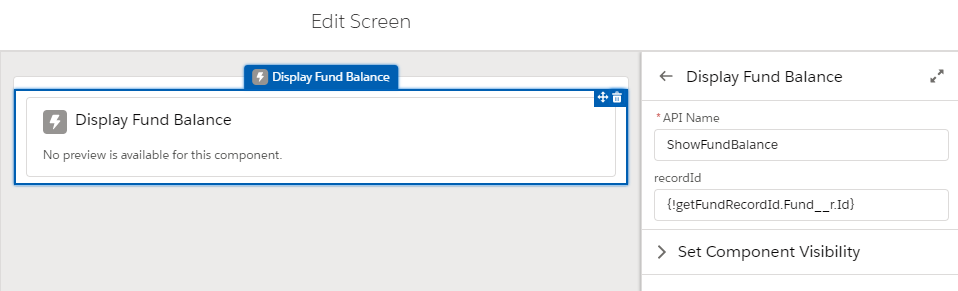
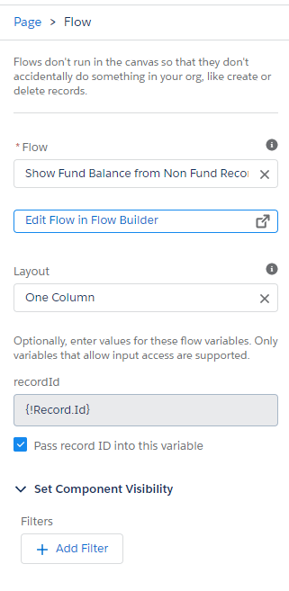

# How to maximize the code you've written for a Lightning Web Component
I recently wrote an LWC for a Community to show a currency field on a custom object called Fund__c. I also utilized Chart.js to graph that currency field against the value of a separate currency field. Quite a bit of logic and formatting went into this component and I thought it would be useful for our Salesforce users to see the same component on the record page.



This was easily achievable by adding both the target, lightningCommunity__Page, and the record page target, lightning__RecordPage, to the component's .js-meta.xml targets tag. Since I was using the @api wire service to get the recordId, I was able to embed it on both pages and it worked properly. Except, in the community page, I needed to add an action button that didn't make sense or work in Salesforce. Since there was no way for the component to know if it was rendering in the community vs Salesforce, there was no easy way to hide the button.

My knee jerk was to copy the whole component to a new component, remove the button and be done with it. But, as I mentioned above, there was a lot of logic and formatting. If anything changed, I would have to maintain the same code in two separate compoents. Don't repeat yourself, right?

## Multiple parents, one child
My solution was to keep the core logic and formatting in a child component, but create two separate parents. This was possible, because the button in question was in the header of the Lightning-Card and I could embed the child component in the body of the lightning card. What thing I learned in this, which seems super obvious in hindsight, the parent is reponsible for getting the recordId from the @api and passing it to the child. The child will not have access to get it passed in directly from the page. Not hard, but tripped me up for a bit.

This is basically the entire .js file for the parent that's embeddable in Salesforce

```javascript
import { LightningElement, api } from 'lwc';

export default class ShowFundBalanceSalesforce extends LightningElement {
  @api recordId;
}
```

In both the parent .html files, here's the call to the child:
```html
<c-show-fund-balance get-record-id={recordId}></c-show-fund-balance>
```

## Using it on a Different Record Page
The above solution worked great until I decided it would be great to show this same component on a page where the recordId in question is referenced as a look up value on a different object, Grant__c. The Grant can reference one and only one Fund. While I could pass in the recordId of the Grant, I couldn't pass in the recordId of the Fund using the Lightning App Page Builder. And since I'm using the @api recordId in the component, I would have to do ~~a lot of~~ logic to determine if the recordId was coming from the Grant or from the Fund.

## Embedding in a Flow
The solution was to create a Screen Flow that embeds my LWC in it. I get the recordId from the page to the Flow, use Get Records in the Flow to get the Fund Id and pass that to the component. It's a very simple solution that only required adding the target lightning__FlowScreen to the Salesforce parent component in addition to the lightning__RecordPage. I also had to add a targetConfigs -> targetConfig to expose the recordId variable to the Flow. Since that target is specific to Flow, it still worked exactly as before on the Fund record page with no changes.

```xml
<targets>
  <target>lightning__RecordPage</target>
  <target>lightning__FlowScreen</target>
</targets>
<targetConfigs>
  <targetConfig targets="lightning__FlowScreen" category="Funds">
    <property name="recordId" type="string" role="inputOnly" />
  </targetConfig>
</targetConfigs>
```
Here's what the Flow looks like:



The Edit Screen:



Notice that I pass into the LWC the {!getFundRecordId.Fund__r.Id}. This is the value retrieved in Get Records. The reason this field is available on the Edit Screen on this component is because of setting the targets as mentioned above.

Lastly, when I add the Flow to the Grant__c record page:



When you check the box, "Pass record ID into this variable," it automatically sets the {!Record.Id} field. The reason this field is available on this page is because in the Flow, when you create the variable, you must make it available for input. Don't forget that step.

## Technical Debt
The addition to the Flow does increase the technical debt a bit. You could argue adding the logic to handle different record ids directly into the code of the LWC is cleaner and easier to maintain. Shrug.
